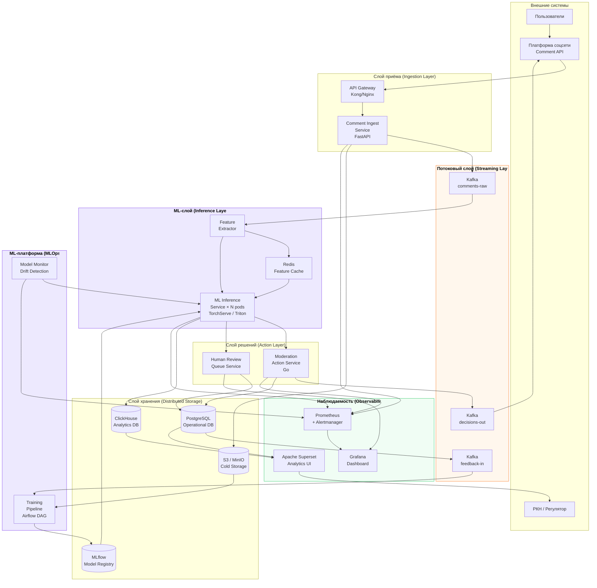

# Архитектура системы

## Общая архитектурная диаграмма



---

## Потоки данных

### Realtime-путь (критический путь, ≤ 5 сек)

```
Комментарий опубликован
        │
        ▼
  API Gateway (auth, rate-limit)  ~5 мс
        │
        ▼
  Comment Ingest Service          ~10 мс
        │
        ├──→ S3 (raw backup, async)
        │
        ▼
  Kafka: comments-raw             ~5 мс
        │
        ▼
  ML Inference Service            ~80–300 мс
  (feature extraction + model)
        │
        ├── score ≥ 0.85 ──→ Moderation Action Service → скрытие → Kafka out
        ├── 0.40–0.85  ──→ Human Review Queue → модератор
        └── score < 0.40 ──→ комментарий опубликован
        │
        ├──→ ClickHouse (async, аналитика)
        └──→ Prometheus (метрики инференса)
```

### Аналитический путь (eventual consistency, секунды)

```
ClickHouse ←── инференс-события (батчи 1 сек)
      │
      └──→ Superset / Grafana: тренды, топ-посты, карта токсичности
```

### ML-путь (еженедельный retrain)

```
Feedback Labels (PostgreSQL)
  + Historical Data (S3)
        │
        ▼
  Airflow DAG: Training Pipeline
        │
        ├── Data validation (Great Expectations)
        ├── Fine-tuning (GPU node)
        ├── Evaluation (offline metrics)
        ├── A/B shadow test
        └── Promotion to production
              │
              ▼
        MLflow → Inference Service (rolling update)
```

---

## Обоснование распределённого хранения

| Вопрос | Ответ |
|---|---|
| Почему не одна БД? | PostgreSQL не справится с OLAP-запросами по 500K событий/день; ClickHouse не подходит для транзакционных операций очереди |
| Почему Kafka, а не HTTP? | При пиковой нагрузке 50 RPS и latency ML 300 мс нужен буфер; Kafka позволяет ML-воркерам обрабатывать в своём темпе |
| Почему S3 для сырых данных? | Стоимость хранения в 10–100× дешевле RDB; нужен полный аудит для РКН за 3+ года |
| Почему Redis? | User-level фичи нужны за < 1 мс до инференса; PostgreSQL не даст такой latency |
