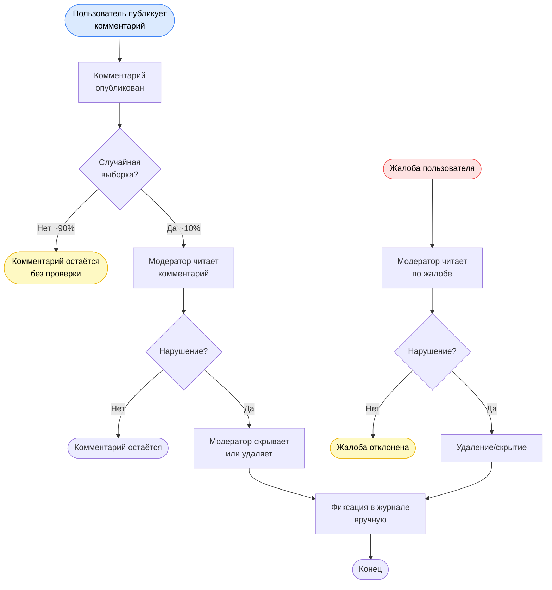
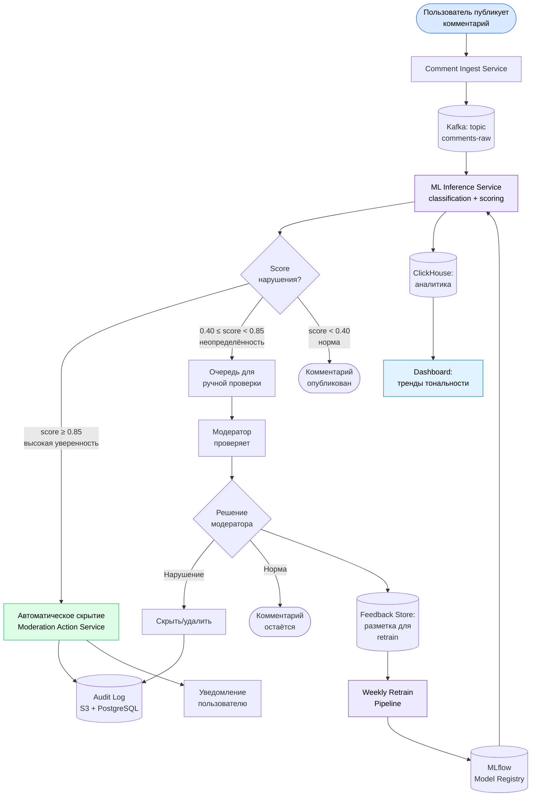

# Диаграммы бизнес-процессов (BPMN)

## AS-IS: Текущий процесс ручной модерации

### Проблемы AS-IS

| Проблема | Последствие |
|---|---|
| Проверяется только ~10% комментариев | 90% нарушений не обнаруживаются вовремя |
| Время реакции: часы | Токсичный контент висит часами |
| Субъективность модераторов | Непоследовательные решения → жалобы |
| Нет приоритизации | Срочные нарушения в очереди вместе с неактуальными |
| Нет аналитики | Невозможно отследить тренды токсичности |

---

## TO-BE: Процесс с ML-системой

### Что меняет ML-система

| Аспект | AS-IS | TO-BE |
|---|---|---|
| **Охват** | ~10% комментариев | 100% комментариев |
| **Скорость** | Часы | < 5 секунд |
| **Объём ручной работы** | 100% | ~10–15% (низкоуверенные) |
| **Последовательность** | Зависит от модератора | Единый воспроизводимый критерий |
| **Аналитика** | Отсутствует | Real-time дашборд |
| **Обучение** | Отсутствует | Автоматический retrain по фидбэку |
| **Аудит** | Ручной журнал | Полный автоматический лог |
