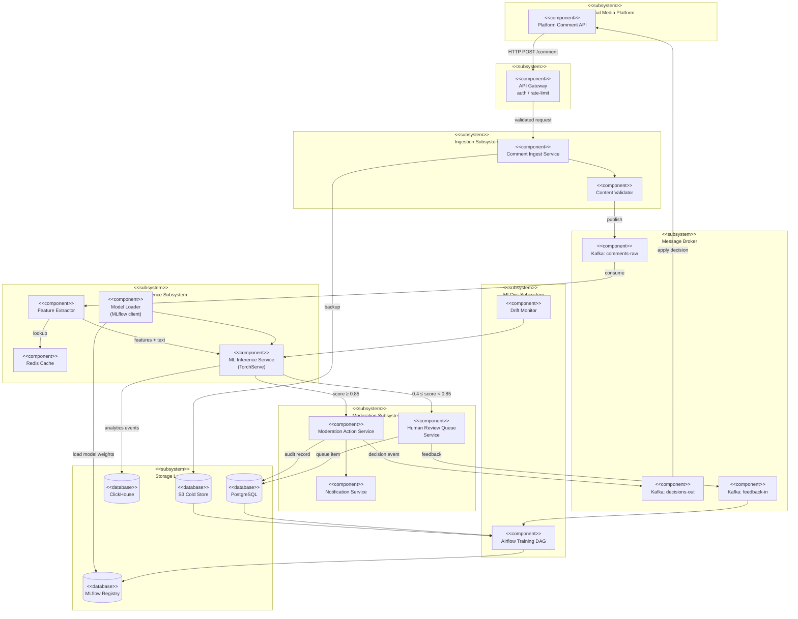
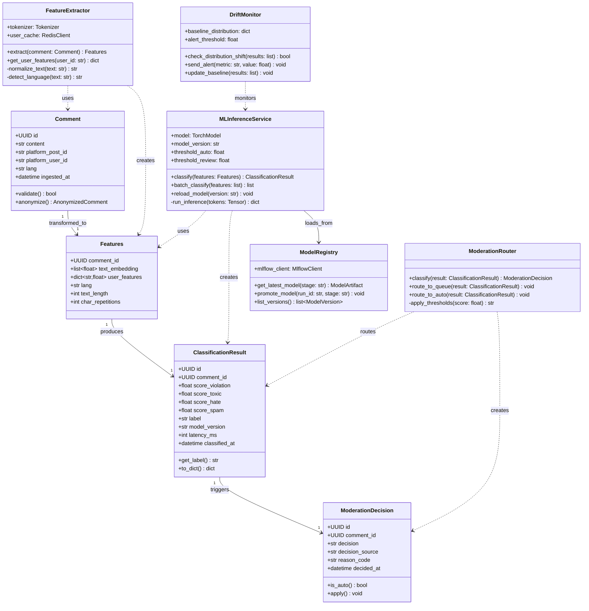
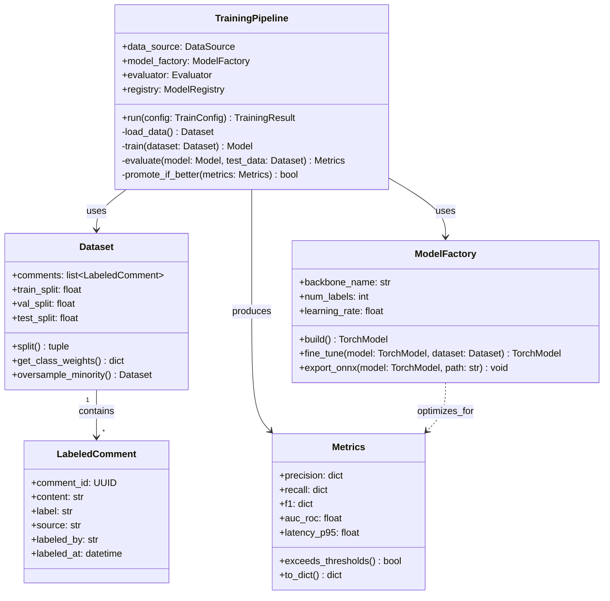

# UML-диаграммы компонентов и классов

## UML Component Diagram

```mermaid
graph TB
    subgraph Platform["&lt;&lt;subsystem&gt;&gt;<br>Social Media Platform"]
        PAPI["&lt;&lt;component&gt;&gt;<br>Platform Comment API"]
    end

    subgraph Gateway["&lt;&lt;subsystem&gt;&gt;<br>API Gateway Layer"]
        AGW["&lt;&lt;component&gt;&gt;<br>API Gateway<br>auth / rate-limit"]
    end

    subgraph Ingest["&lt;&lt;subsystem&gt;&gt;<br>Ingestion Subsystem"]
        CIS["&lt;&lt;component&gt;&gt;<br>Comment Ingest Service"]
        VAL["&lt;&lt;component&gt;&gt;<br>Content Validator"]
    end

    subgraph Broker["&lt;&lt;subsystem&gt;&gt;<br>Message Broker"]
        KIN["&lt;&lt;component&gt;&gt;<br>Kafka: comments-raw"]
        KOUT["&lt;&lt;component&gt;&gt;<br>Kafka: decisions-out"]
        KFB["&lt;&lt;component&gt;&gt;<br>Kafka: feedback-in"]
    end

    subgraph MLInference["&lt;&lt;subsystem&gt;&gt;<br>ML Inference Subsystem"]
        FE["&lt;&lt;component&gt;&gt;<br>Feature Extractor"]
        RC["&lt;&lt;component&gt;&gt;<br>Redis Cache"]
        MLINF["&lt;&lt;component&gt;&gt;<br>ML Inference Service<br>(TorchServe)"]
        MLOAD["&lt;&lt;component&gt;&gt;<br>Model Loader<br>(MLflow client)"]
    end

    subgraph Moderation["&lt;&lt;subsystem&gt;&gt;<br>Moderation Subsystem"]
        MAS["&lt;&lt;component&gt;&gt;<br>Moderation Action Service"]
        HRQ["&lt;&lt;component&gt;&gt;<br>Human Review Queue<br>Service"]
        NOTIF["&lt;&lt;component&gt;&gt;<br>Notification Service"]
    end

    subgraph Storage["&lt;&lt;subsystem&gt;&gt;<br>Storage Layer"]
        PG[("&lt;&lt;database&gt;&gt;<br>PostgreSQL")]
        CH[("&lt;&lt;database&gt;&gt;<br>ClickHouse")]
        S3[("&lt;&lt;database&gt;&gt;<br>S3 Cold Store")]
        MLREG[("&lt;&lt;database&gt;&gt;<br>MLflow Registry")]
    end

    subgraph MLOps["&lt;&lt;subsystem&gt;&gt;<br>MLOps Subsystem"]
        AIRFLOW["&lt;&lt;component&gt;&gt;<br>Airflow Training DAG"]
        DRIFTMON["&lt;&lt;component&gt;&gt;<br>Drift Monitor"]
    end

    PAPI -->|HTTP POST /comment| AGW
    AGW -->|validated request| CIS
    CIS --> VAL
    VAL -->|publish| KIN
    CIS -->|backup| S3

    KIN -->|consume| FE
    FE -->|lookup| RC
    FE -->|features + text| MLINF
    MLOAD -->|load model weights| MLREG
    MLOAD --> MLINF

    MLINF -->|score ≥ 0.85| MAS
    MLINF -->|0.4 ≤ score &lt; 0.85| HRQ
    MLINF -->|analytics events| CH

    MAS -->|decision event| KOUT
    MAS -->|audit record| PG
    MAS --> NOTIF
    KOUT -->|apply decision| PAPI

    HRQ -->|queue item| PG
    HRQ -->|feedback| KFB

    KFB --> AIRFLOW
    S3 --> AIRFLOW
    AIRFLOW --> MLREG
    DRIFTMON --> MLINF
    PG --> AIRFLOW
```

---

## UML Class Diagram (основные классы ML Inference Subsystem)

```mermaid
classDiagram
    class Comment {
        +UUID id
        +str content
        +str platform_post_id
        +str platform_user_id
        +str lang
        +datetime ingested_at
        +validate() bool
        +anonymize() AnonymizedComment
    }

    class Features {
        +UUID comment_id
        +list~float~ text_embedding
        +dict~str,float~ user_features
        +str lang
        +int text_length
        +int char_repetitions
    }

    class ClassificationResult {
        +UUID id
        +UUID comment_id
        +float score_violation
        +float score_toxic
        +float score_hate
        +float score_spam
        +str label
        +str model_version
        +int latency_ms
        +datetime classified_at
        +get_label() str
        +to_dict() dict
    }

    class ModerationDecision {
        +UUID id
        +UUID comment_id
        +str decision
        +str decision_source
        +str reason_code
        +datetime decided_at
        +is_auto() bool
        +apply() void
    }

    class FeatureExtractor {
        +tokenizer: Tokenizer
        +user_cache: RedisClient
        +extract(comment: Comment) Features
        +get_user_features(user_id: str) dict
        -normalize_text(text: str) str
        -detect_language(text: str) str
    }

    class MLInferenceService {
        +model: TorchModel
        +model_version: str
        +threshold_auto: float
        +threshold_review: float
        +classify(features: Features) ClassificationResult
        +batch_classify(features: list) list
        +reload_model(version: str) void
        -run_inference(tokens: Tensor) dict
    }

    class ModerationRouter {
        +classify(result: ClassificationResult) ModerationDecision
        +route_to_queue(result: ClassificationResult) void
        +route_to_auto(result: ClassificationResult) void
        -apply_thresholds(score: float) str
    }

    class ModelRegistry {
        +mlflow_client: MlflowClient
        +get_latest_model(stage: str) ModelArtifact
        +promote_model(run_id: str, stage: str) void
        +list_versions() list~ModelVersion~
    }

    class DriftMonitor {
        +baseline_distribution: dict
        +alert_threshold: float
        +check_distribution_shift(results: list) bool
        +send_alert(metric: str, value: float) void
        +update_baseline(results: list) void
    }

    Comment "1" --> "1" Features : transformed_to
    Features "1" --> "1" ClassificationResult : produces
    ClassificationResult "1" --> "1" ModerationDecision : triggers

    FeatureExtractor ..> Comment : uses
    FeatureExtractor ..> Features : creates
    MLInferenceService ..> Features : uses
    MLInferenceService ..> ClassificationResult : creates
    MLInferenceService --> ModelRegistry : loads_from
    ModerationRouter ..> ClassificationResult : routes
    ModerationRouter ..> ModerationDecision : creates
    DriftMonitor ..> MLInferenceService : monitors
```

---

## UML Class Diagram (MLOps Subsystem)

```mermaid
classDiagram
    class TrainingPipeline {
        +data_source: DataSource
        +model_factory: ModelFactory
        +evaluator: Evaluator
        +registry: ModelRegistry
        +run(config: TrainConfig) TrainingResult
        -load_data() Dataset
        -train(dataset: Dataset) Model
        -evaluate(model: Model, test_data: Dataset) Metrics
        -promote_if_better(metrics: Metrics) bool
    }

    class Dataset {
        +comments: list~LabeledComment~
        +train_split: float
        +val_split: float
        +test_split: float
        +split() tuple
        +get_class_weights() dict
        +oversample_minority() Dataset
    }

    class LabeledComment {
        +comment_id: UUID
        +content: str
        +label: str
        +source: str
        +labeled_by: str
        +labeled_at: datetime
    }

    class Metrics {
        +precision: dict
        +recall: dict
        +f1: dict
        +auc_roc: float
        +latency_p95: float
        +exceeds_thresholds() bool
        +to_dict() dict
    }

    class ModelFactory {
        +backbone_name: str
        +num_labels: int
        +learning_rate: float
        +build() TorchModel
        +fine_tune(model: TorchModel, dataset: Dataset) TorchModel
        +export_onnx(model: TorchModel, path: str) void
    }

    TrainingPipeline --> Dataset : uses
    TrainingPipeline --> ModelFactory : uses
    TrainingPipeline --> Metrics : produces
    Dataset "1" --> "*" LabeledComment : contains
    ModelFactory ..> Metrics : optimizes_for
```
