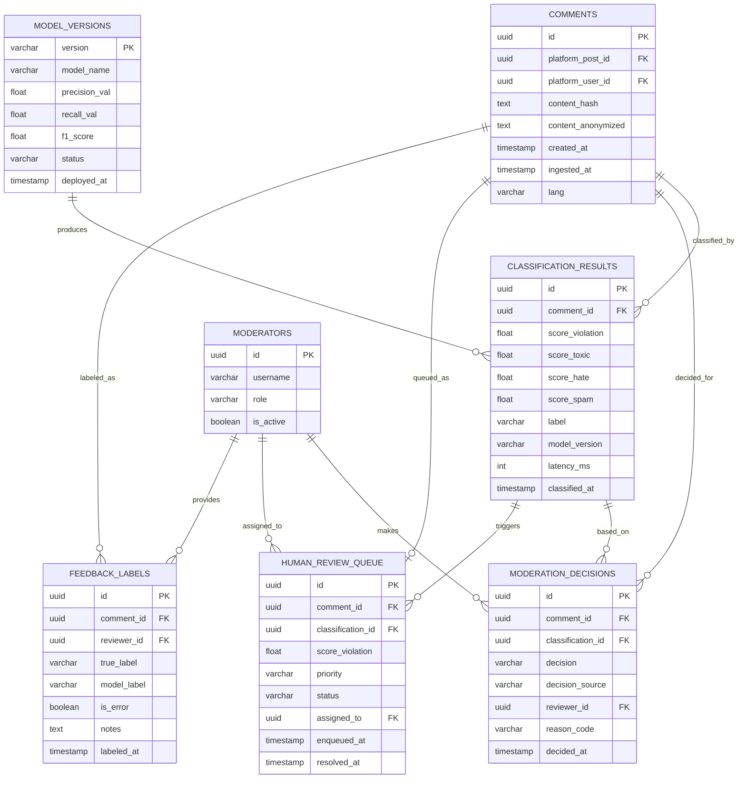

# Структура данных

## ER-диаграмма (реляционная часть — PostgreSQL)



---

## Распределённая структура хранилищ

```
┌─────────────────────────────────────────────────────────────────────┐
│                     ДАННЫЕ СИСТЕМЫ SentinelAI                       │
│                                                                     │
│  ┌───────────────────┐    ┌───────────────────┐                     │
│  │   Apache Kafka    │    │    Redis Cache    │                     │
│  │  (Streaming)      │    │  (Hot Data)       │                     │
│  │                   │    │                   │                     │
│  │ • comments-raw    │    │ • user_features   │                     │
│  │ • decisions-out   │    │ • recent_scores   │                     │
│  │ • feedback-in     │    │ • model_warmup    │                     │
│  │                   │    │                   │                     │
│  │ Retention: 7 дней │    │ TTL: 1–24 ч       │                     │
│  └───────────────────┘    └───────────────────┘                     │
│                                                                     │
│  ┌───────────────────┐    ┌───────────────────┐                     │
│  │   PostgreSQL      │    │   ClickHouse      │                     │
│  │  (Operational)    │    │  (Analytics)      │                     │
│  │                   │    │                   │                     │
│  │ • comments        │    │ • events_hourly   │                     │
│  │ • decisions       │    │ • sentiment_daily │                     │
│  │ • review_queue    │    │ • model_metrics   │                     │
│  │ • feedback_labels │    │ • content_trends  │                     │
│  │ • moderators      │    │                   │                     │
│  │                   │    │ Partitioned by    │                     │
│  │ Retention: 90 дней│    │ date (monthly)    │                     │
│  └───────────────────┘    └───────────────────┘                     │
│                                                                     │
│  ┌───────────────────┐    ┌───────────────────┐                     │
│  │   S3 / MinIO      │    │   MLflow          │                     │
│  │  (Cold Storage)   │    │  (ML Registry)    │                     │
│  │                   │    │                   │                     │
│  │ • raw_comments/   │    │ • model artifacts │                     │
│  │ • audit_logs/     │    │ • experiments     │                     │
│  │ • training_data/  │    │ • metrics history │                     │
│  │ • model_backups/  │    │ • feature schemas │                     │
│  │                   │    │                   │                     │
│  │ Retention: 3+ года│    │ Retention: всегда │                     │
│  └───────────────────┘    └───────────────────┘                     │
└─────────────────────────────────────────────────────────────────────┘
```

### Почему данные распределены?

| Хранилище | Причина выбора |
|---|---|
| **Kafka** | Декаплинг продюсеров и консьюмеров; буфер при пиках нагрузки; гарантия доставки exactly-once |
| **Redis** | Latency < 1 мс для фич пользователя в момент инференса; TTL-управление |
| **PostgreSQL** | ACID-транзакции для решений модераторов; JOIN-запросы для очереди |
| **ClickHouse** | Columnar-хранение; агрегации по 500K событий/день за секунды |
| **S3** | Дешёвое хранение сырых данных; неограниченный объём; основа для обучения |
| **MLflow** | Стандарт версионирования моделей; сравнение экспериментов; reproducibility |

### Политика хранения и конфиденциальность

- **Сырое содержимое комментариев** не хранится в PostgreSQL — только `content_hash` и анонимизированная версия.
- **Полный текст** хранится в S3 с шифрованием AES-256, доступ по RBAC.
- Данные старше 3 лет удаляются в соответствии с ФЗ-152 (автоматический TTL).
- `platform_user_id` — хешированный псевдоним, не позволяет идентифицировать пользователя без ключа платформы.
