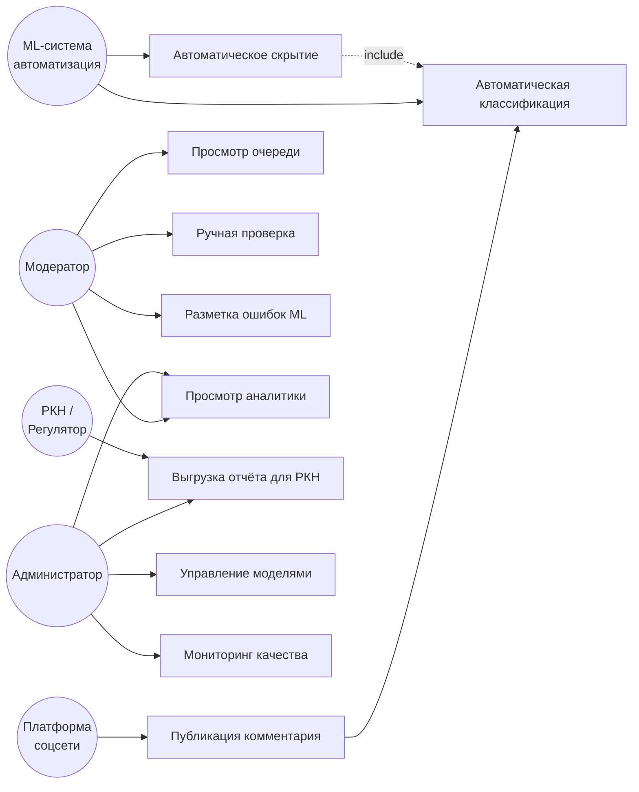
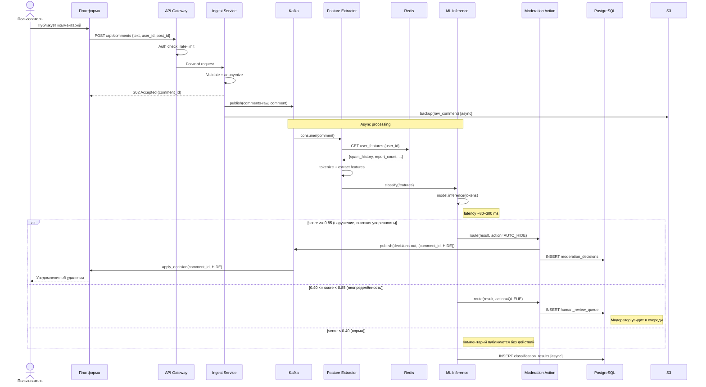
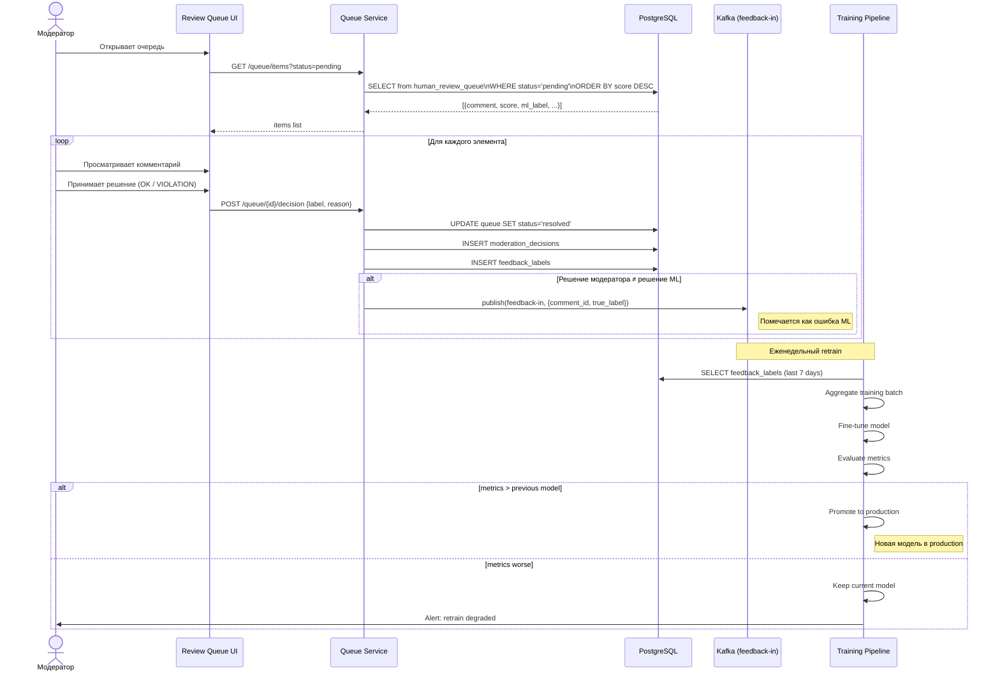
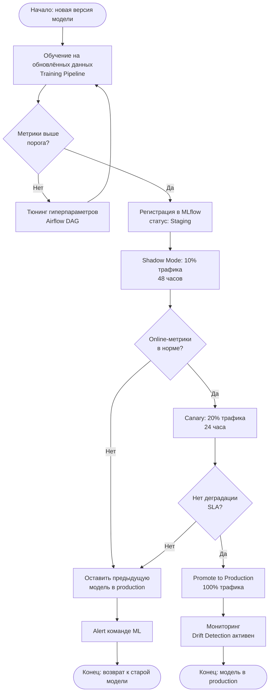

# UML-диаграммы поведения

## Диаграмма прецедентов (Use Case Diagram)

---

## Диаграмма последовательности: Автоматическая модерация (Happy Path)

---

## Диаграмма последовательности: Ручная проверка + Feedback

---

## Диаграмма активностей: Onboarding новой ML-модели

